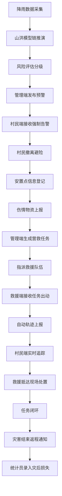

# FloodGuard 洪水安防地理智能系统 - 产品需求文档（PRD）

## 1. 产品概述

FloodGuard 是一套面向山区山洪、山体滑坡灾害的全栈Web+移动端自适应智能预警调度系统，涵盖**灾害推演预警、实时救援调度、灾后农业损失统计**三大业务闭环。系统对标外卖平台三方协同模式（管理后台-用户-骑手），实现从"单一报警"到"精准推演行动指挥"的升级，服务于水利气象部门、辖区村民、应急救援队伍、农业灾情统计员四类用户群体。

- **核心目标**：通过完整山洪模型链推演，精准回答"哪里会受灾、多久会受灾、哪些人需要转移、走哪条路避险"
- **目标用户**：山区县乡水利气象调度中心、辖区村民、专业救援队伍、农业灾情统计员
- **核心价值**：所有灾害信息依托精准WGS84经纬度坐标可视化展示，预警可溯源、可核查，实现应急救援精准化、可视化、可落地

## 2. 核心功能

### 2.1 用户角色

| 角色 | 定位 | 登录方式 | 核心权限 |
|------|------|----------|----------|
| 水利气象调度管理员 | 平台管理方（最高权限） | 账号密码登录 | 全局监控、风险推演、预警发布、救援调度、数据总控 |
| 辖区村民 | 普通用户方（终端使用者） | 手机号+村组登录 | 接收预警、避险登记、伤情物资上报、救援追踪 |
| 应急救援队伍 | 执行方（骑手角色） | 队伍编号+密码登录 | 接收任务、轨迹上报、现场处置、离线导航 |
| 农业灾情统计员 | 灾后运营端（后台统计） | 账号密码登录 | 种养受灾数据录入、汇总、查看、导出 |

### 2.2 功能模块

#### 角色一：水利气象调度管理端（PC端 1920×1080）

1. **指挥调度大屏**：左侧菜单 + 中间GIS地图大屏 + 右侧数据台账三栏布局
2. **预警发布中心**：四级预警发布（红/橙/黄/蓝），自动生成村民通俗版+专业溯源版双文案
3. **实时监控**：全域人员坐标、救援轨迹、风险区域实时态势
4. **人员GIS台账**：全部村民精准坐标、到达安置点时间、同行人数、伤情状态、物资需求
5. **救援全局调度**：营救任务生成、队伍指派、轨迹监控、进度闭环
6. **灾情数据汇总**：受伤人员、物资缺口、高危滞留人员统筹

#### 角色二：辖区村民用户端（移动端 375×667）

1. **强制预警推送**：弹窗+语音播报，无法忽略，展示本地险情、避险点位、转移路线
2. **标准化避险指引**：山洪、山体滑坡官方逃生教程，离线可查
3. **安置点信息登记**：姓名、村组、同行人数、实景拍照、自动上传GIS坐标与到达时间
4. **伤情与物资上报**：受伤等级（无/轻微/重度）+ 物资需求（药品/水/食品/保暖）
5. **外卖式救援追踪**：救援队伍实时坐标、行进轨迹、预计抵达时间，自动刷新
6. **灾后返程通知**：险情解除后接收官方返家通知

#### 角色三：应急救援队伍端（移动端）

1. **任务自动接收**：目标坐标、危险地形、禁行路线、最优路线、伤情、物资需求
2. **自动轨迹上报**：后台持续上报GIS位置，同步管理端与村民端
3. **现场处置更新**：抵达签到、人员状态、伤员救助、物资发放，闭环任务
4. **离线路线导航**：规避滑坡、洪水高危路段

#### 角色四：农业灾情统计员端（PC端）

1. **村民灾后信息登记**：受灾村民姓名、村组信息
2. **种植业损失统计**：作物类型、受灾亩数、损毁程度、预估损失、设施损毁
3. **养殖业损失统计**：养殖品类、存栏量、死亡走失、圈舍损毁、预估损失
4. **灾情台账汇总**：全村全乡数据汇总、可视化台账、Excel导出

### 2.3 页面详情

| 页面名称 | 所属角色 | 模块名称 | 功能描述 |
|----------|----------|----------|----------|
| 统一登录页 | 全角色 | 角色选择登录 | 四类角色入口，根据角色跳转对应端 |
| 指挥调度大屏 | 管理端 | GIS态势地图 | 风险区标注、人员点位、救援轨迹、左侧菜单、右侧台账 |
| 预警发布中心 | 管理端 | 模型链推演 | 八环节推演展示、双文案生成、四级发布 |
| 人员GIS台账 | 管理端 | 全域人员台账 | 村民坐标列表、状态统计、详情查看 |
| 救援调度面板 | 管理端 | 全局救援监控 | 任务列表、队伍指派、轨迹回放 |
| 灾情汇总面板 | 管理端 | 灾情数据统筹 | 受伤统计、物资缺口、滞留人员 |
| 村民首页 | 村民端 | 预警通栏+功能入口 | 预警通栏闪烁、四大功能按钮、底部导航 |
| 预警详情页 | 村民端 | 险情+避险指引 | 预警详情、避险教程、转移路线、安置点 |
| 安置点登记页 | 村民端 | 信息登记表单 | 姓名、村组、人数、拍照、坐标上传 |
| 伤情物资上报页 | 村民端 | 上报表单 | 伤情等级、物资需求选择 |
| 救援追踪页 | 村民端 | 外卖式追踪 | 救援轨迹、预计抵达、实时刷新 |
| 救援任务列表 | 救援端 | 任务接收 | 指派任务列表、状态筛选 |
| 任务执行页 | 救援端 | 导航+处置 | 轨迹地图、任务卡片、操作按钮 |
| 灾情登记表单 | 统计员端 | 损失录入 | 村民信息、种植损失、养殖损失 |
| 灾情台账表格 | 统计员端 | 台账汇总 | 列表展示、翻页、Excel导出 |

## 3. 核心流程

### 3.1 灾害预警到救援闭环主流程

1. 管理端采集降雨数据 → 运行山洪模型链八环节推演 → 生成风险评估等级
2. 管理端发布四级预警 → 全域村民端接收强制告警（弹窗+语音）
3. 村民按避险指引撤离 → 到达安置点登记 → 上报伤情与物资需求
4. 管理端接收村民上报 → 生成营救任务 → 指派救援队伍
5. 救援队伍接收任务 → 自动上报轨迹 → 村民端实时追踪进度
6. 救援队伍抵达现场 → 签到处置 → 闭环任务
7. 灾害结束 → 管理端发布返程通知 → 统计员录入灾后损失

### 3.2 流程图

## 4. 用户界面设计

### 4.1 设计风格

- **主色**：#005288（应急蓝，管理端/救援端导航）
- **辅助色**：#2E7DFF（浅蓝，村民端按钮）
- **预警色（国标）**：红色#E62020、橙色#F57C00、黄色#FBC000、蓝色#1976D2
- **安全色**：#27AE60（绿色）
- **背景**：#F5F7FA；卡片：#FFFFFF；文字主：#1D2129；文字次：#4E5969；边框：#E5E6EB
- **字体**：中文思源黑体（Noto Sans SC），英文Roboto
- **按钮**：圆角6px，主按钮高44px，文字加粗
- **卡片**：圆角8px，阴影0 2px 8px rgba(0,0,0,0.08)
- **导航栏**：顶部固定，高度56px
- **图标风格**：扁平线性图标，政务严肃风格

### 4.2 页面设计概览

| 页面名称 | 模块名称 | UI要素 |
|----------|----------|--------|
| 统一登录页 | 角色卡片选择 | 四宫格角色入口卡片，应急蓝主色调，政务正式风格 |
| 指挥调度大屏 | GIS地图区 | Leaflet地图，风险区彩色标注，人员图标，轨迹线，左220px菜单+右320px台账 |
| 预警发布中心 | 模型链推演面板 | 八环节步骤流，参数输入，双文案预览，四级颜色按钮 |
| 村民首页 | 预警通栏+功能按钮 | 顶部48px预警色闪烁通栏，四个56px高大按钮，底部五项导航 |
| 救援任务执行页 | 轨迹地图+任务卡 | 上半屏地图蓝色动态路线，下半屏白色任务卡片，底部橙色操作栏 |
| 灾情台账 | 筛选栏+表单+表格 | 顶部筛选，左侧录入表单，右侧分页表格，导出按钮 |

### 4.3 响应式适配

- **PC端（管理端/统计员端）**：桌面优先设计，1920×1080最佳，最小1280px
- **移动端（村民端/救援端）**：移动优先设计，375×667基准，自适应至768px
- **触控优化**：移动端按钮最小44×44px触控区域，间距充足
- **弱网支持**：核心避险指引、安置点登记表单支持离线缓存填写

## 5. 关键技术约束

1. **预警模型全链路推演**：禁止单一雨量阈值报警，每条预警必须附带完整八环节推演依据
2. **精准坐标**：所有位置使用WGS84经纬度坐标，无模糊文字描述
3. **实时救援追踪**：外卖式动态刷新，可视化轨迹
4. **伤情分级**：完整支持无受伤/轻微受伤/重度受伤三级
5. **权限隔离**：四类角色严格隔离，各司其职，数据互通不越权
6. **政务用语**：全程政务标准正式用语，禁用网络口语
