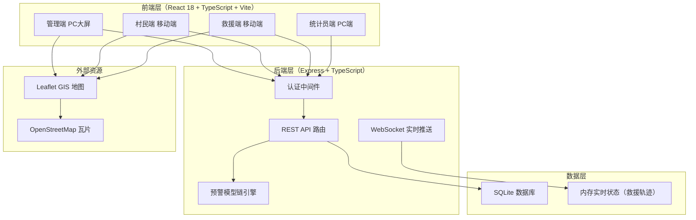
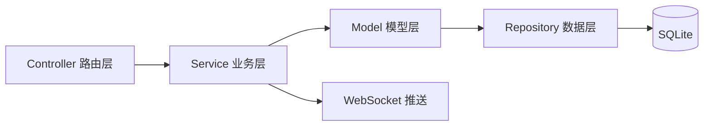
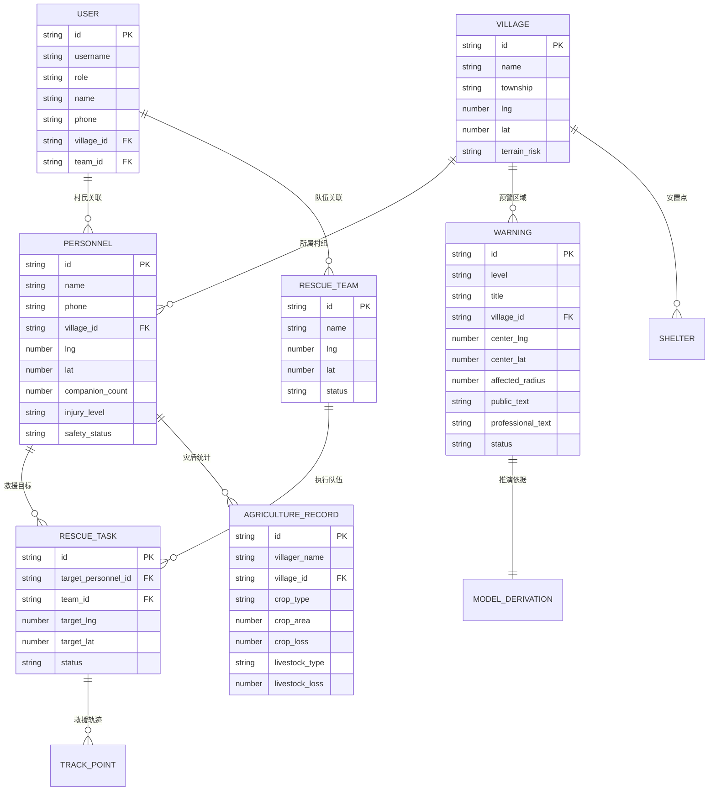

# FloodGuard 洪水安防地理智能系统 - 技术架构文档

## 1. 架构设计



## 2. 技术选型

- **前端**：React@18 + TypeScript + Vite + TailwindCSS@3
- **路由**：react-router-dom@6
- **状态管理**：zustand
- **GIS地图**：Leaflet + react-leaflet（开源轻量，无需API Key）
- **图标**：lucide-react
- **后端**：Express@4 + TypeScript（ESM格式）
- **数据库**：SQLite（better-sqlite3，零配置部署）
- **实时通信**：WebSocket（ws库，救援轨迹实时推送）
- **初始化工具**：vite-init（react-express-ts模板）

## 3. 路由定义

### 3.1 前端路由

| 路由 | 用途 | 所属角色 |
|------|------|----------|
| `/login` | 统一登录页，角色选择 | 全角色 |
| `/admin` | 指挥调度大屏（GIS地图） | 管理端 |
| `/admin/warning` | 预警发布中心（模型链推演） | 管理端 |
| `/admin/monitor` | 实时监控面板 | 管理端 |
| `/admin/personnel` | 人员GIS台账 | 管理端 |
| `/admin/rescue` | 救援调度面板 | 管理端 |
| `/admin/disaster` | 灾情数据汇总 | 管理端 |
| `/villager` | 村民首页（预警通栏+功能入口） | 村民端 |
| `/villager/warning` | 预警详情与避险指引 | 村民端 |
| `/villager/register` | 安置点信息登记 | 村民端 |
| `/villager/report` | 伤情与物资上报 | 村民端 |
| `/villager/rescue` | 救援实时追踪 | 村民端 |
| `/villager/profile` | 个人信息 | 村民端 |
| `/rescue` | 救援任务列表 | 救援端 |
| `/rescue/task/:id` | 任务执行页（地图+处置） | 救援端 |
| `/agriculture` | 灾情登记表单 | 统计员端 |
| `/agriculture/ledger` | 灾情台账表格 | 统计员端 |

### 3.2 后端API路由

| 方法 | 路由 | 用途 |
|------|------|------|
| POST | `/api/auth/login` | 统一登录（角色+凭证） |
| GET | `/api/auth/me` | 获取当前登录用户信息 |
| GET | `/api/warnings` | 获取预警列表 |
| POST | `/api/warnings` | 发布预警（管理端） |
| GET | `/api/warnings/:id` | 获取预警详情（含推演依据） |
| POST | `/api/warnings/simulate` | 运行模型链推演（管理端） |
| GET | `/api/personnel` | 获取全域人员台账（管理端） |
| POST | `/api/personnel/register` | 安置点登记（村民端） |
| POST | `/api/personnel/report` | 伤情物资上报（村民端） |
| GET | `/api/rescue/tasks` | 获取救援任务列表 |
| POST | `/api/rescue/tasks` | 创建救援任务（管理端） |
| PATCH | `/api/rescue/tasks/:id` | 更新任务状态（救援端） |
| POST | `/api/rescue/location` | 上报救援队伍位置 |
| GET | `/api/rescue/track/:taskId` | 获取救援轨迹 |
| GET | `/api/agriculture/records` | 获取灾情台账 |
| POST | `/api/agriculture/records` | 录入灾情数据（统计员端） |
| GET | `/api/shelters` | 获取安置点列表 |
| GET | `/api/villages` | 获取村组列表 |
| GET | `/api/dashboard/stats` | 获取大屏统计数据 |

## 4. API 数据定义

### 4.1 核心TypeScript类型

```typescript
// 用户角色
type UserRole = 'admin' | 'villager' | 'rescue' | 'agriculture';

// 预警等级（国标）
type WarningLevel = 'red' | 'orange' | 'yellow' | 'blue';

// 伤情等级
type InjuryLevel = 'none' | 'minor' | 'severe';

// 用户
interface User {
  id: string;
  username: string;
  role: UserRole;
  name: string;
  phone: string;
  villageId?: string;       // 村民所属村组
  teamId?: string;          // 救援队伍所属
}

// 预警信息
interface Warning {
  id: string;
  level: WarningLevel;
  title: string;
  villageId: string;
  villageName: string;
  centerLng: number;        // WGS84经度
  centerLat: number;        // WGS84纬度
  affectedRadius: number;   // 影响半径(米)
  publishTime: string;
  expireTime: string;
  publicText: string;       // 村民通俗版文案
  professionalText: string; // 专业溯源版文案
  derivation: ModelDerivation; // 模型链推演依据
  status: 'active' | 'expired' | 'cancelled';
}

// 山洪预警模型链推演结果
interface ModelDerivation {
  rainfall: { intensity: number; cumulative: number; forecast: number }; // 降雨输入
  runoff: { peakFlow: number; convergenceTime: number; yieldTime: number }; // 产汇流
  channelRouting: { peakArrivalTime: number; sections: ChannelSection[] }; // 沟道演进
  inundation: { area: number; maxDepth: number; depthDistribution: string }; // 淹没分析
  riskAssessment: { hazard: number; exposure: number; vulnerability: number; level: WarningLevel }; // 风险评估
  transferTask: { personCount: number; routes: string[]; shelterId: string; responsible: string }; // 转移任务
}

// 人员台账
interface Personnel {
  id: string;
  name: string;
  phone: string;
  villageId: string;
  villageName: string;
  lng: number;
  lat: number;
  shelterArriveTime?: string;
  companionCount: number;
  injuryLevel: InjuryLevel;
  materialNeeds: string[];
  safetyStatus: 'pending' | 'sheltered' | 'rescuing' | 'safe';
}

// 救援任务
interface RescueTask {
  id: string;
  targetPersonnelId: string;
  targetName: string;
  targetLng: number;
  targetLat: number;
  teamId: string;
  teamName: string;
  injuryLevel: InjuryLevel;
  materialNeeds: string[];
  hazardNote: string;
  forbiddenRoutes: string[];
  optimalRoute: string;
  status: 'pending' | 'dispatched' | 'enroute' | 'arrived' | 'completed';
  createdAt: string;
  ETA?: number; // 预计抵达分钟
}

// 救援轨迹点
interface TrackPoint {
  taskId: string;
  lng: number;
  lat: number;
  timestamp: string;
}

// 农业灾情记录
interface AgricultureRecord {
  id: string;
  villagerName: string;
  villageId: string;
  villageName: string;
  cropType?: string;
  cropArea?: number;
  cropDamage?: string;
  cropLoss?: number;
  livestockType?: string;
  livestockOriginal?: number;
  livestockDead?: number;
  barnDamage?: string;
  livestockLoss?: number;
  createdAt: string;
}
```

## 5. 服务架构图



- **Controller层**：接收HTTP请求，参数校验，调用Service
- **Service层**：业务逻辑（预警模型链推演、任务调度、权限校验）
- **Repository层**：数据CRUD操作（better-sqlite3）
- **WebSocket**：救援轨迹、预警推送实时通信

## 6. 数据模型

### 6.1 ER图



### 6.2 数据定义语言（DDL）

```sql
-- 村组表
CREATE TABLE IF NOT EXISTS villages (
  id TEXT PRIMARY KEY,
  name TEXT NOT NULL,
  township TEXT NOT NULL,
  lng REAL NOT NULL,
  lat REAL NOT NULL,
  terrain_risk TEXT NOT NULL
);

-- 安置点表
CREATE TABLE IF NOT EXISTS shelters (
  id TEXT PRIMARY KEY,
  name TEXT NOT NULL,
  village_id TEXT NOT NULL,
  lng REAL NOT NULL,
  lat REAL NOT NULL,
  capacity INTEGER DEFAULT 0,
  FOREIGN KEY (village_id) REFERENCES villages(id)
);

-- 用户表（四类角色）
CREATE TABLE IF NOT EXISTS users (
  id TEXT PRIMARY KEY,
  username TEXT UNIQUE NOT NULL,
  password TEXT NOT NULL,
  role TEXT NOT NULL CHECK(role IN ('admin','villager','rescue','agriculture')),
  name TEXT NOT NULL,
  phone TEXT,
  village_id TEXT,
  team_id TEXT,
  FOREIGN KEY (village_id) REFERENCES villages(id)
);

-- 救援队伍表
CREATE TABLE IF NOT EXISTS rescue_teams (
  id TEXT PRIMARY KEY,
  name TEXT NOT NULL,
  leader_name TEXT,
  member_count INTEGER DEFAULT 0,
  lng REAL,
  lat REAL,
  status TEXT DEFAULT 'idle'
);

-- 预警表
CREATE TABLE IF NOT EXISTS warnings (
  id TEXT PRIMARY KEY,
  level TEXT NOT NULL CHECK(level IN ('red','orange','yellow','blue')),
  title TEXT NOT NULL,
  village_id TEXT NOT NULL,
  center_lng REAL NOT NULL,
  center_lat REAL NOT NULL,
  affected_radius REAL NOT NULL,
  public_text TEXT NOT NULL,
  professional_text TEXT NOT NULL,
  derivation_json TEXT NOT NULL,
  publish_time TEXT NOT NULL,
  expire_time TEXT NOT NULL,
  status TEXT DEFAULT 'active',
  FOREIGN KEY (village_id) REFERENCES villages(id)
);

-- 人员台账表
CREATE TABLE IF NOT EXISTS personnel (
  id TEXT PRIMARY KEY,
  name TEXT NOT NULL,
  phone TEXT,
  village_id TEXT NOT NULL,
  lng REAL NOT NULL,
  lat REAL NOT NULL,
  shelter_arrive_time TEXT,
  companion_count INTEGER DEFAULT 1,
  injury_level TEXT DEFAULT 'none',
  material_needs TEXT,
  safety_status TEXT DEFAULT 'pending',
  photo_url TEXT,
  FOREIGN KEY (village_id) REFERENCES villages(id)
);

-- 救援任务表
CREATE TABLE IF NOT EXISTS rescue_tasks (
  id TEXT PRIMARY KEY,
  target_personnel_id TEXT NOT NULL,
  target_name TEXT NOT NULL,
  target_lng REAL NOT NULL,
  target_lat REAL NOT NULL,
  team_id TEXT NOT NULL,
  injury_level TEXT,
  material_needs TEXT,
  hazard_note TEXT,
  forbidden_routes TEXT,
  optimal_route TEXT,
  status TEXT DEFAULT 'pending',
  eta_minutes INTEGER,
  created_at TEXT NOT NULL,
  completed_at TEXT,
  FOREIGN KEY (target_personnel_id) REFERENCES personnel(id),
  FOREIGN KEY (team_id) REFERENCES rescue_team(id)
);

-- 救援轨迹表
CREATE TABLE IF NOT EXISTS track_points (
  id INTEGER PRIMARY KEY AUTOINCREMENT,
  task_id TEXT NOT NULL,
  team_id TEXT NOT NULL,
  lng REAL NOT NULL,
  lat REAL NOT NULL,
  timestamp TEXT NOT NULL,
  FOREIGN KEY (task_id) REFERENCES rescue_tasks(id)
);

-- 农业灾情记录表
CREATE TABLE IF NOT EXISTS agriculture_records (
  id TEXT PRIMARY KEY,
  villager_name TEXT NOT NULL,
  village_id TEXT NOT NULL,
  crop_type TEXT,
  crop_area REAL,
  crop_damage TEXT,
  crop_loss REAL,
  livestock_type TEXT,
  livestock_original INTEGER,
  livestock_dead INTEGER,
  barn_damage TEXT,
  livestock_loss REAL,
  created_at TEXT NOT NULL,
  FOREIGN KEY (village_id) REFERENCES villages(id)
);

-- 索引
CREATE INDEX IF NOT EXISTS idx_warnings_village ON warnings(village_id);
CREATE INDEX IF NOT EXISTS idx_warnings_status ON warnings(status);
CREATE INDEX IF NOT EXISTS idx_personnel_village ON personnel(village_id);
CREATE INDEX IF NOT EXISTS idx_rescue_tasks_team ON rescue_tasks(team_id);
CREATE INDEX IF NOT EXISTS idx_rescue_tasks_status ON rescue_tasks(status);
CREATE INDEX IF NOT EXISTS idx_track_points_task ON track_points(task_id);
CREATE INDEX IF NOT EXISTS idx_agri_records_village ON agriculture_records(village_id);
```

## 7. 山洪预警模型链实现说明

系统后端实现完整的八环节模型链推演引擎（`api/services/warningModel.ts`）：

1. **降雨输入**：输入雨强(mm/h)、累计雨量(mm)、预报雨量(mm)
2. **产汇流计算**：基于SCS-CN曲线数法估算产流，计算汇流时间
3. **沟道演进**：基于马斯京根法简化模拟洪峰传播
4. **淹没分析**：基于地形坡度与影响半径估算淹没范围
5. **风险评估**：综合危险性（暴雨强度）、暴露度（人口密度）、脆弱性（地形）得出四级风险
6. **分级预警**：风险等级映射红/橙/黄/蓝
7. **转移任务**：生成转移人员清单、路线、安置点
8. **反馈校正**：预留参数校正接口（本次演示使用预设参数）

每条预警生成时，`derivation_json`字段完整存储上述八环节推演结果，确保预警可溯源、可核查。
